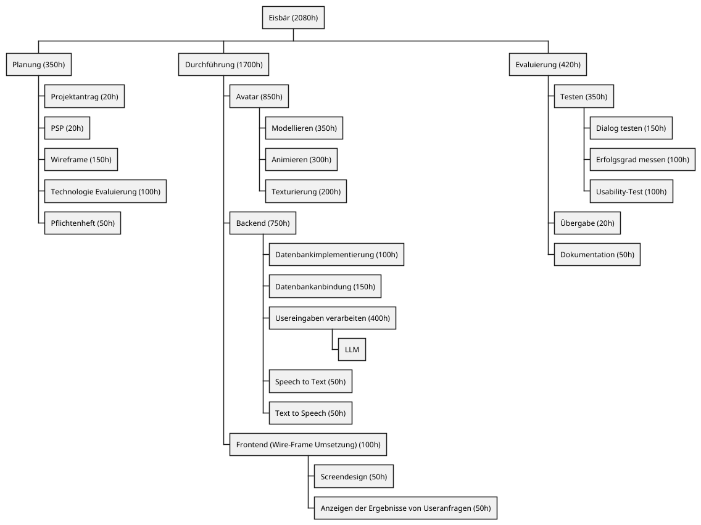

:toc: macro

= EISBÄR

toc::[]

== Description

The projects helps customers to find desired products in a store.
They can talk to a polar bear avatar, which tells them the location of the requested items.

=== USP
A talking Polar Bear Avatar

=== Problem
Customers take a long time searching for their desired products in the store.
With a talking avatar, the employees of the store are relieved and have more time to focus on other tasks.

== PSP project Eisbär

creators: Stützner, Öller, Michel, Brandstätter, Klaffenböck on 15.10.2024

=== Calculation of hours:
* 52 weeks
* 2 weeks sick leave per person
* 5 persons
* 8 hours per person per week

==== Formula
(52 weeks - (2 weeks ill * 5 persons)) * 8 hours per week * 5 persons

==== Result
( 52 - ( 2 * 5 )) * 8 * 5 = 1680

==== Conclusion
In 52 school weeks there are 1680 working hours for 5 persons if everyone is ill for 2 weeks.
Otherwise there would be 2080 working hours.

== Commit messages

=== Message template
if there is an issue for the current commit:

<type> <#issue number>: <description>

if there is no issue for the commit (f.e. A small commit for updating the README) just leave out the issue number:

<type>: <description>

=== Type explanation
* *Fixed:* a commit of the type _fixed_ patches a bug in your code
* *Fixing in progress:* a commit of the type _fixing in progress_ shows that a patch of a bug is not finished yet
* *Added:* a commit of the type _added_ adds a new file or feature
* *Changed:* a commit of the type _changed_ changes a file or a code part
* *Removed:* a commit of the type _removed_ removes a file or a code part
* *Moved* : a commit of the type _moved_ moves a file to a different folder

=== Message examples
* fixed #12: wrong result when calling getArticle
* fixing in progress #4: wrong result when doing GET on ArticleResource
* added #6: 'message examples' in README.adoc
* changed #23: return type in getDate method
* removed #12: method calculateBirthDate
* moved #5: index.html from 'documents' to 'resources'

== Startup Guide

=== Installations
==== Install jq
Use command `sudo apt install jq` to download the JSON-processing tool (used for OpenSearch and GPT3.5)

=== Copy the Git repo on your device
1. Click on the green 'Code <>' button
2. Select 'SSH'
3. Copy the path
4. Open the command line and move to your preferred folder
5. Type the command `git clone <path>`

=== Open the project
1. On the command line move to the folder 'eisbaer' with the command `cd eisbaer`
2. open the project with your preferred IDE (With command: `idea .` or `code .`)

=== Start Project
1. Open the console in your IDE
2. run the build.sh file with `./build.sh`

=== View the frontend of the project
1. Open your preferred Browser (works best with Google Chrome)
2. type `http://localhost:8080/` and press enter

== Shutdown Guide

=== Shutdown Quarkus
1. Open the terminal where you started quarkus
2. Press `q` to shutdown quarkus

=== Shutdown Postgres and OpenSearch
1. In the same terminal run down.sh with `./down.sh`

== Technologies

=== Avatar
* **ChatGPT** (https://chatgpt.com/)
** Used for creating an image of an polar bear
* **Vidnnoz** (https://www.vidnoz.com/)
** Used for creating an AI-talking-video out of an image
* **Seamless Loop Video Maker** (https://tech-lagoon.com/moviechef/en/movie-seamless-loop.html)
** Used for creating a loop out of the talking-video
* **Unscreen** (https://www.unscreen.com/)
** Used for removing background of a video

=== Technologie-Evaluierung: OpenSearch vs Elasticsearch

==== Einführung
Für das Eisbär-Projekt, das eine interaktive Produktsuche ermöglicht, ist die Wahl der geeigneten Such- und Analyseplattform entscheidend. Diese Evaluierung vergleicht die beiden Plattformen OpenSearch und Elasticsearch in den Bereichen Lizenzierung, Funktionen, Cloud-Integration, Leistung und Sicherheit.

==== Lizenzierung und Community
*Elasticsearch*: Wechselte von der Apache 2.0-Lizenz zu restriktiveren Lizenzen wie der Server Side Public License (SSPL) und der Elastic License, was insbesondere bei der Nutzung in Cloud-Umgebungen Einschränkungen verursacht.

*OpenSearch*: Vollständig Open-Source unter der Apache 2.0-Lizenz. Dies ermöglicht eine freie Nutzung, Anpassung und Verbreitung ohne Vendor-Lock-in. OpenSearch wird von einer aktiven Open-Source-Community vorangetrieben.

==== Funktionen und Plugins
*Elasticsearch*: Bietet ein ausgereiftes Ökosystem mit Tools wie Kibana und Plugins für maschinelles Lernen und Anomalieerkennung. Einige dieser Funktionen sind jedoch proprietär und erfordern kostenpflichtige Lizenzen.

*OpenSearch*: Verfügt über OpenSearch Dashboards als Alternative zu Kibana sowie Open-Source-Plugins für Sicherheit, Observability und Benachrichtigungen. Die Funktionen decken die meisten Anwendungsfälle ab, jedoch ohne proprietäre Features wie Elasticsearchs maschinelles Lernen.

==== Cloud-Integrationen
*Elasticsearch*: Elastic Cloud bietet eine umfassende Unterstützung für AWS, Azure und Google Cloud und ermöglicht eine nahtlose Integration mit dem Elastic-Ökosystem.

*OpenSearch*: Optimiert für den Amazon OpenSearch Service und tief in AWS-Dienste wie Lambda und S3 integriert. Die Plattform ist einfach in selbstgehosteten oder alternativen Cloud-Umgebungen bereitzustellen.

==== Leistung und Skalierbarkeit
*Elasticsearch*: Hohe Leistung und Skalierbarkeit bei groß angelegten Datenverarbeitungen, unterstützt durch fortschrittliche Optimierungen und proprietäre Funktionen.

*OpenSearch*: Vergleichbare Leistung und Skalierbarkeit, die durch eine aktive Community kontinuierlich verbessert wird. OpenSearch erfordert jedoch möglicherweise zusätzliche Feinabstimmungen bei komplexen Szenarien.

==== Sicherheit
*Elasticsearch*: Sicherheitsfunktionen wie rollenbasierte Zugriffskontrolle (RBAC) und Audit-Protokollierung sind Teil der Premium-Angebote.

*OpenSearch*: Integrierte Sicherheits-Plugins stehen kostenfrei zur Verfügung, einschließlich RBAC, Verschlüsselung und Audit-Logging. Diese Funktionen sind vollständig Open-Source.

==== Fazit
Für das Eisbär-Projekt stellt OpenSearch die bessere Wahl dar. Die Plattform bietet eine offene, lizenzkostenfreie Lösung, die durch die Apache 2.0-Lizenz Flexibilität und langfristige Planungssicherheit gewährleistet. Mit starken AWS-Integrationen, umfassenden Sicherheitsfunktionen und einer aktiven Community erfüllt OpenSearch die Anforderungen des Projekts optimal. Elasticsearch bietet zwar zusätzliche Funktionen, doch die Lizenzkosten und potenziellen Einschränkungen durch proprietäre Lizenzen machen es weniger attraktiv. OpenSearch ist daher die wirtschaftlichere und zukunftssichere Option.

=== ChatGPT 3.5 Turbo vs Mistral

GPT 3.5 ist integriert in die OpenSearch KI Unterstützung und OpenSearch wurde ausschließlich mit OpenAI Produkten getestet
.

[cols="1,1,1,1", options="header"]
|===
| Kriterium        | GPT-3.5 Turbo                 | Mistral                    | DeepSeek
| Einfachheit      | Hoch                          | Mittel                     | Mittel
| Kosten           | Bezahlt pro Nutzung           | eigene Ressourcen, oder kostenpflichtig API          | eigene Ressourcen, oder kostenpflichtig API
| Anpassbarkeit    | Gering                        | Hoch                       | Mittel
| Skalierbarkeit   | Sehr hoch                     | Mittel                     | Hoch
| Datenschutz      | Cloud-basiert                 | Vollständig lokal möglich  | Schlecht
|===

Anmerkungen:

- DeepSeek ist chinesisch zensiert und gibt unzureichende Informationen
über die chinesische Regierung und Ereignisse in der chinesische Geschichte
- Da DeepSeek eine chinesische Firma ist, ist die Sicherheit der Daten nicht gewährleistet
