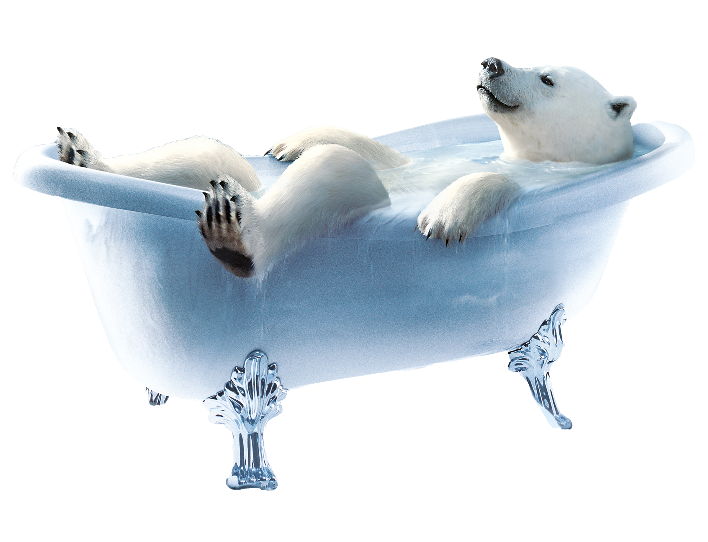

:toc: macro

= Progress Michael Stützner

toc::[]

== 2025-13-01
=== Trying to change the voice of the polar bear
With Google Chromes standard voice API it only provides a German female voice or an English male voice.
But we are looking for a German male voice. Also, it sounds very robotic and not natural.

We are now trying with 'ResponiveVoice' which is a text-to-speech library that can be used
to create speech-enabled web applications.

https://responsivevoice.org/api/

Implement this script to the project to use the API:

* 

== 2025-20-10
=== Trying out new Avatar on screen
We went to the basement and tried out our new design on the big screen that will be used to
display our project in the future

The person responsible for the screen wasn't there!

== 2025-10-11
=== Meeting with Schubert + AV
AV said he will talk to us on 19th November 2025.

=== Meeting with Hammer
Focus will shift more onto the Avatar. We wrote an email to Prof. Stütz regarding his AI-Video of
the polar bear in the bathtub talking.

=== Generating new Avatar
==== 1.
* easemate.ai/image-to-video-generator
* Prompt: make the polar bear talk

video::../media/ai-videos/easemate.mp4[]
* Note: Background Color shifts from greyish to white and black tones. The movements in the beginning look weird,
but overall it's a pretty good try. Not perfect tho and definetly not ready to use.

==== 2.
* deevid.ai/image-to-video
* Prompt: the polarbear is moving his mouth as if he was talking

video::../media/ai-videos/deevid.mp4.mp4[]
* Note: Tried it with the polar bear in the bathtub picture. Camera doesn't stay static. A lot of
movement. Polar bear just moves around almost randomly, it doesn't resemble the movement of talking.

==== 3.
* firefly.adobe.com
* Prompt: keep the camera static, make the polar bear talk, only move the mouth and the head, move the legs and arms
a little bit but only just so it looks alive.

video::../media/ai-videos/firefly1.mp4[]
* Note: I tried a longer and more specific prompt to see if that overcomplicates it or if it adds the
last necessary tweaks. ALso tried using Firefly, a more commonly known AI-Model. He now moves his arms and legs A LOT.
 Also his snout is deformed in the beginning.

==== 4.
* firefly.adobe.com
* Prompt: make the polar bear talk

video::../media/ai-videos/firefly2.mp4[]
* Note: Trying out a very simple prompt in Firefly. Now Water splashes out of the tub at the beginning. After he
completely turns to the side and starts talking. Maybe try specifying that the bear shouldn't move?

== 2025-11-11
=== Creating new Avatar
==== Cut out polar bear
Used Photoshop to cut out the polar bear in the bathtub, so that there's no background

==== More Background
I also tried doing it the other way around and use AI to create
more background so that we could maybe use the whole picture and integrate
the background into the UI

image::../../frontend/public/img/eisbaer-scholle.jpg[width=700]

==== Further Plan
Try to create and idle video loop of the background and polar bear just slightly
moving around to create the illusion of it being "alive" and generally
make it feel more natural.

Questions:

* Which AI do we use?
* What Tool do we use to make it loop?

Problems:

* Can't access the Firefly AI Generator with the school Account and only
3 Free tries with private Email
* Polar Bear always moves too much in the AI generated videos

Conclusion:

* Maybe try using some other Software like AfterEffects or Illustrator
to animate the idle video "by hand" and only use AI for the talking animation.

== 2025-17-11
=== Image-to-Video Generation

==== Key Principles
- Define *exactly* what should move and what must stay still.
- Start with constraints.
- Use a clear structure (f.e. camera -> allowed movement -> constraints)
- Shorter prompts often perform better.

==== Example Template
----
Create a short video from the reference image.
Camera remains perfectly still.
Only the mouth animates naturally for speech.
No body movement, no limb motion, no background changes.
----

=== General AI Reliability & Consistency

==== Improve Reliability
- Use simple, direct language.
- Define motion style with terms like “subtle” and “steady”.
- Provide negative instructions (“no blur", "no warping”).
- Maintain consistent *prompt structure*.
- Use "iterative refinement".

==== Useful Phrases
- Maintain consistent lighting.
- Do not introduce new elements.
- Preserve the original anatomy and proportions.

=== Conclusion
Clarity, constraints, and precise motion control improve stability and realism.
Reference images, short prompts, and strict motion limits produce the best results.
Also try to keep the same structure for each prompt to improve consistency.
Negative instructions can help to avoid unwanted motions.
Don't be afraid to be precise and over-descriptive.

==== Source
for more best-practices:
https://help.openai.com/en/articles/6654000-best-practices-for-prompt-engineering-with-the-openai-api[OpenAI Best Practices for Prompt Engineering]

== 2025-18-11
=== Market research
==== Are there any competitors doing similar projects?
- There are many AI-chatbots, but mostly with
    an animated avatar like we are planning to do.
- There are some websites using animated characters for customer support,
    but they are mostly not using AI to generate responses.
- Most AI chatbots are text-based or use simple avatars without complex animations.
- There are some AI-Avatars with splendid responsive animations, but they
    are only human-like avatars.
* https://www.soulmachines.com/meet-the-ai-avatar
- Our combination of an AI customer support with a talking animated polar bear avatar
    seems to be unique.

==== Interesting AI Avatar Services to look at
- https://www.mascot.bot/
- https://www.aivatar.ai/en/product/chatbot
- https://www.character.ai/
- https://www.replicate.com/
- https://www.genies.com/

== 2025-01-12
=== Reconstruction of Aula in bulk_data_aula
During the lesson we went upstairs to the Aula. We created a new file called bulk_data_aula, where
we tried to reconstruct some core elements of the aula like the stage, the window to the streaming room, the main
camera, the smartboards, ...
This will later help us demonstrate our project in a more realistic environment. It will be used
to showcase that the project works and can be used in a real-world scenario.

=== Fixing Project locally
First I had to fix some issues with the project locally.
When I tried to open the project, IntelliJ told me that my folder is corrupted.
After trying out a few things, I just deleted the folder and freshly cloned the repository.
The issue probably occurred, because I moved some folders and files onto a hard drive and this somehow
corrupted the git repository.

=== Deciding which approach to use
We discussed which approach to use for the Avatar generation.
We have two main options:

1. Have a static background and a second layer with the polar bear in the bathtub cut out.
- Pros:
    * More control over the background and polar bear separately
    * No unnecessary movements in the background
- Cons:
    * More difficult to implement the layers in the frontend
    * Might be difficult to get a cutout video of the polar bear that looks good
    * Creating a seamless loop with a talking and non-talking polar-bear might be difficult

2. Have a full video of the polar bear in the bathtub with background.
- Pros:
    * Easier to implement in the frontend
    * Easier to create a seamless loop
- Cons:
    * Less control over the background and polar bear separately
    * Background might have unnecessary movements that distract the user

We decided to try out both approaches and see which one works better.

=== Further difficulties with AI-Video generation
It is really hard to find an AI-Video generator that allows us to create a video for free.
Most of them have a limited number of free tries or require a paid subscription.
Even with a paid subscription one of the main difficulties is to get the prompt right.
Either the polar bear moves too much, the background changes or the camera moves.

=== Further documentation of AI-Video generation attempts
From now on I won't document every single try, but only the most promising ones.
This is to avoid cluttering the progress document with too many bad or sloppy AI-Videos.
Also, I will try to use the best practices for prompt engineering that is mentioned above.

=== New AI-Video generation attempts
==== mindvideo.ai
* Prompt: Animate a polar bear peacefully seated in a bathtub, maintaining a
stationary body posture. Gradually have the bear tilt its head towards the camera
in a deliberate, controlled manner. The bear should speak for a few seconds with gentle,
expressive mouth movements and calm eyes. After the short talk, it should slowly bring
its head back to its initial neutral position. The camera remains fixed throughout,
with a medium shot framing that highlights the bear’s head and upper torso, emphasizing
its quiet interaction without any abrupt motions.

==== Result
video::../media/ai-videos/mindvideo.mp4[]
* Note: Overall not too bad. The only real problem is that the bathtub overflows and this seems
to be a common problem with AI-Video generators.

==== Tried once more with mindvideo.ai
I tweaked the prompt to also mention that the bathtub must not overflow and that there should not be
any unnecessary movement in the background or within the bathtub. Problem now is that the polar bear just moves his
head towards the camera and then back to the side without talking.
